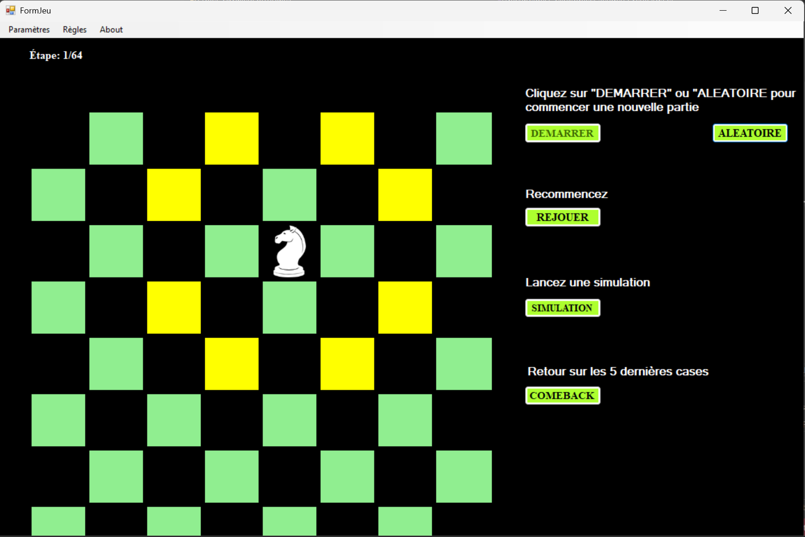
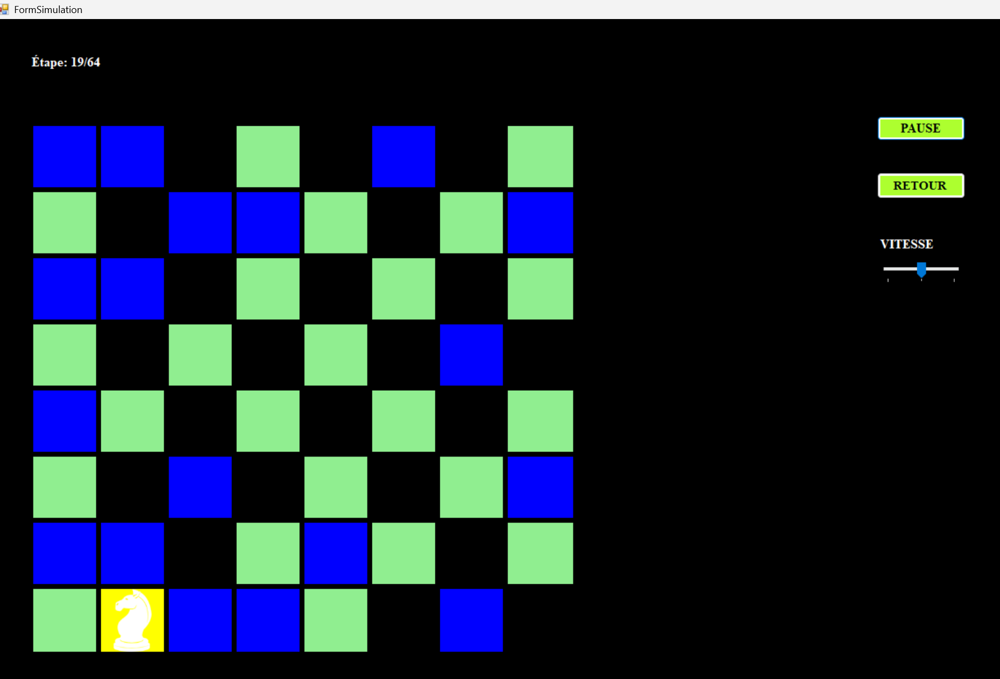
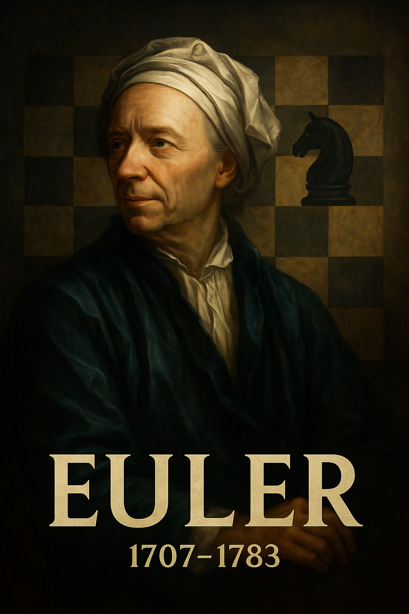
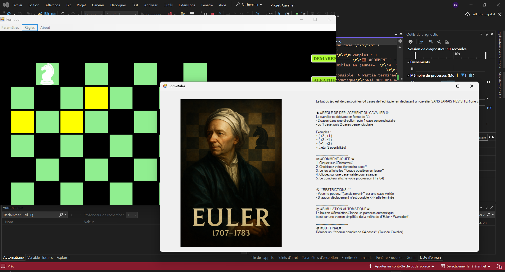
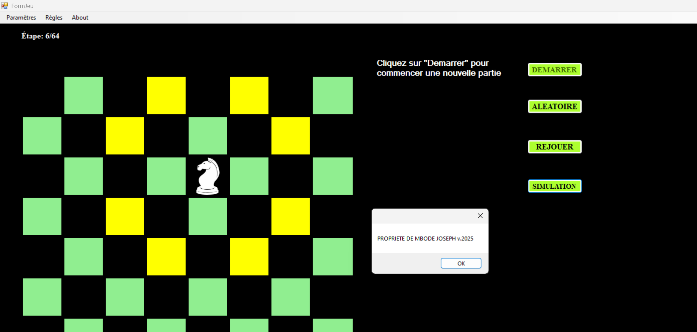
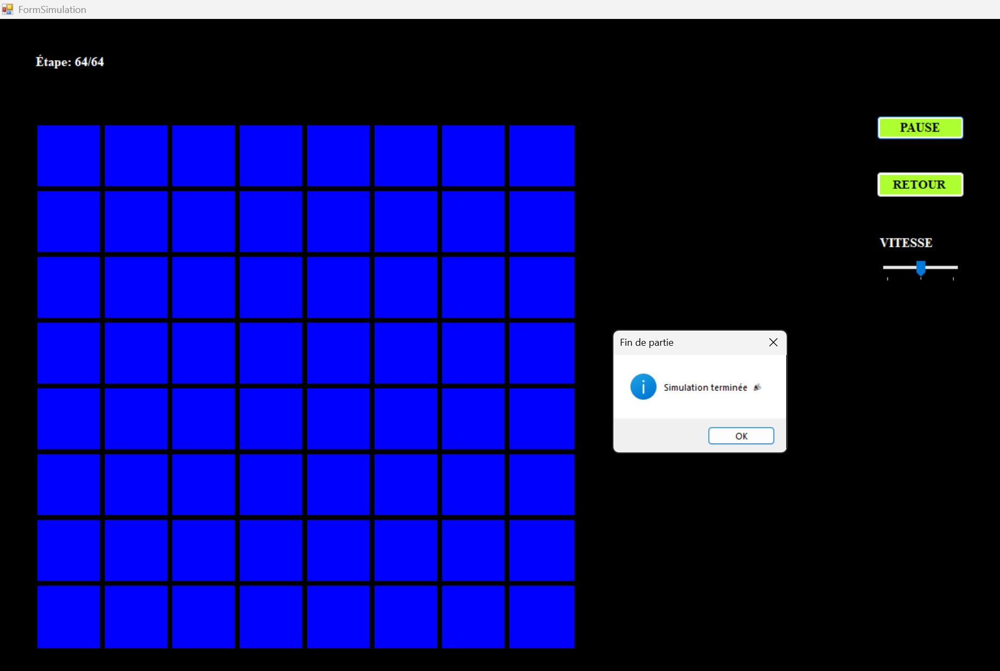
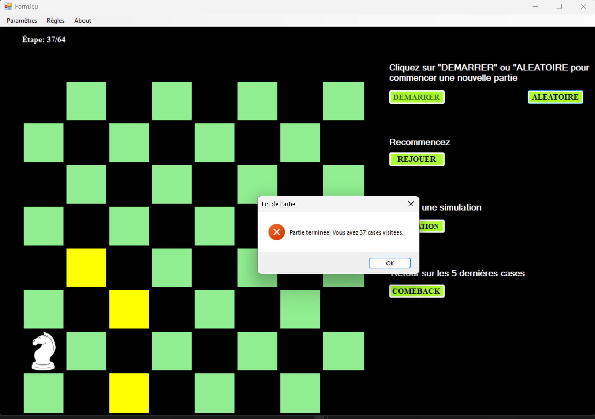

# Knight's Tour | C# WinForms



A C# WinForms application that implements the **Knight's Tour** problem on a chessboard.

The project provides an interactive board for manual play, random move selection and an animated automatic simulation based on the **Warnsdorff heuristic**, commonly used to efficiently explore a Knight's Tour.

The application was developed as an educational project combining object-oriented programming, graphical user interfaces, algorithmic problem solving and simulation.

---

## Overview

The Knight's Tour is a classical chessboard problem: move a knight so that it visits every square exactly once, while respecting standard knight moves.

A legal knight move follows the pattern:

```text
±2 rows and ±1 column
or
±1 row and ±2 columns
```

The objective is to visit all 64 squares of an 8 × 8 chessboard without revisiting any square.

```text
Target: 64 visited squares
```

---

## Features

- Interactive 8 × 8 chessboard.
- Manual game mode.
- Random move mode.
- Automatic Knight's Tour simulation.
- Animated movement from square to square.
- Euler/Warnsdorff-inspired move selection strategy.
- Legal-move verification.
- Visited-square tracking.
- Win and loss detection.
- Pause and resume controls for the automatic simulation.
- Adjustable simulation speed.
- Rules window.
- About window.
- Theme-aware graphical interface.
- Visual feedback for completed and blocked tours.

---

## Application Screenshots

### Start window


### Main game board



### Automatic Euler/Warnsdorff simulation



### Rules window



### About window



### Winning state



### Blocked or lost state



---

## Algorithm

The automatic mode uses a heuristic inspired by **Warnsdorff's rule**.

At each position, the application:

1. Generates all legal knight moves.
2. Removes moves that lead outside the board.
3. Removes already visited squares.
4. Evaluates the number of onward legal moves for each candidate.
5. Prioritizes the move with the fewest onward possibilities.
6. Updates the chessboard, visited-square list and animation.
7. Stops when all squares are visited or when no valid move remains.

This strategy attempts to avoid blocking the knight early by selecting constrained squares first.

> The Warnsdorff heuristic is a practical strategy for finding many knight tours, but it is not a proof that every initial position or every tie-breaking method will always complete a tour.

---

## Project Screenshots and Sketches

The repository also includes visual project notes and UI sketches:

| File | Description |
|---|---|
| [`assets/screenshots/sketch.png`](assets/screenshots/sketch.png) | Initial application interface sketch |
| [`assets/screenshots/sketch2.png`](assets/screenshots/sketch2.png) | Additional interface or navigation sketch |
| [`assets/screenshots/sketch3.png`](assets/screenshots/sketch3.png) | Additional screen design concept |
| [`assets/screenshots/tree_project.png`](assets/screenshots/tree_project.png) | Project structure illustration |

---

## Requirements

| Requirement | Version / information |
|---|---|
| Operating system | Windows |
| IDE | Visual Studio |
| Framework | .NET Framework 4.7.2 |
| Language | C# |
| Application type | Windows Forms |

---

## Running the project

1. Clone the repository:

   ```bash
   git clone https://github.com/Josephulrich/knights-tour-winforms.git
   ```

2. Open the solution in Visual Studio:

   ```text
   src/Projet_Cavalier.sln
   ```

3. Restore or confirm the `.NET Framework 4.7.2` developer pack is installed.

4. Build the solution:

   ```text
   Build → Build Solution
   ```

5. Run the application:

   ```text
   Debug → Start Without Debugging
   ```

The compiled executable is generated locally in the project's `bin/Debug/` directory. Build outputs are intentionally not tracked by Git.

---

## Project structure

```text
.
├── archive/
│   └── Projet_Cavalier.zip
│
├── assets/
│   ├── images/
│   │   ├── cav_brown.png
│   │   ├── icon.ico
│   │   └── white_cav.png
│   └── screenshots/
│       ├── about.png
│       ├── begin.png
│       ├── euler.png
│       ├── game.png
│       ├── lost.png
│       ├── rules.png
│       ├── sketch.png
│       ├── sketch2.png
│       ├── sketch3.png
│       ├── tree_project.png
│       └── winning.png
│
├── docs/
│   └── Projet-Cavalier-Final.pdf
│
└── src/
    ├── Projet_Cavalier.sln
    └── Projet_Cavalier/
        ├── App.config
        ├── Form1.cs
        ├── Form1.Designer.cs
        ├── Form1.resx
        ├── FormRules.cs
        ├── FormRules.Designer.cs
        ├── FormRules.resx
        ├── FormSimulation.cs
        ├── FormSimulation.Designer.cs
        ├── FormSimulation.resx
        ├── Program.cs
        ├── Projet_Cavalier.csproj
        ├── Images/
        └── Properties/
```

Generated folders such as `bin/`, `obj/` and `.vs/` are excluded through `.gitignore`.

---

## Important files

| File | Purpose |
|---|---|
| [`src/Projet_Cavalier.sln`](src/Projet_Cavalier.sln) | Visual Studio solution |
| [`src/Projet_Cavalier/Projet_Cavalier.csproj`](src/Projet_Cavalier/Projet_Cavalier.csproj) | WinForms project definition |
| [`src/Projet_Cavalier/Program.cs`](src/Projet_Cavalier/Program.cs) | Application entry point |
| [`src/Projet_Cavalier/Form1.cs`](src/Projet_Cavalier/Form1.cs) | Main game interface and board logic |
| [`src/Projet_Cavalier/FormRules.cs`](src/Projet_Cavalier/FormRules.cs) | Rules window |
| [`src/Projet_Cavalier/FormSimulation.cs`](src/Projet_Cavalier/FormSimulation.cs) | Automatic simulation interface |
| [`docs/Projet-Cavalier-Final.pdf`](docs/Projet-Cavalier-Final.pdf) | Project report |
| [`archive/Projet_Cavalier.zip`](archive/Projet_Cavalier.zip) | Archived project backup |

---

## Knight movement model

The eight possible relative moves of a chess knight are:

```text
(-2, -1)  (-2, +1)
(-1, -2)  (-1, +2)
(+1, -2)  (+1, +2)
(+2, -1)  (+2, +1)
```

A move is accepted only if:

- Its destination stays inside the 8 × 8 board.
- The destination square has not already been visited.
- The current game state allows a new move.

---

## Possible improvements

- Add a board-size selector.
- Add a selectable starting square.
- Add step-by-step visualization of candidate move degrees.
- Add a selectable tie-breaking strategy.
- Compare pure random mode, backtracking and Warnsdorff's heuristic.
- Export the complete tour path to CSV or JSON.
- Add statistics such as elapsed time, visited squares and number of attempts.
- Add sound effects and accessibility settings.
- Add unit tests for legal moves and tour validation.
- Migrate to modern .NET and WPF, Avalonia or a web interface.

---

## License

This repository is provided for educational and portfolio purposes.

---

## Author

**Joseph Mbode**

Embedded systems, electronics, mechatronics and software projects.

- GitHub: [@Josephulrich](https://github.com/Josephulrich)
- LinkedIn: [Joseph Mbode](https://www.linkedin.com/in/joseph-mbode)
